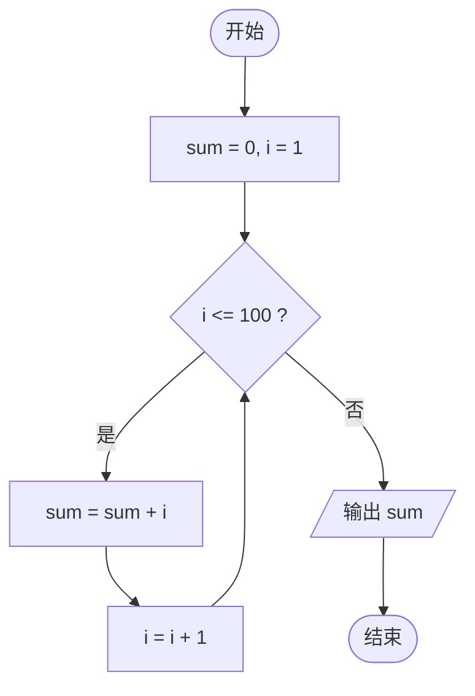

---
tags:
  - C语言
  - 算法
  - 第二章
---

# 第二章 算法——程序的灵魂

> [!abstract] 本章目标
> - 理解算法的概念和特征
> - 掌握算法的表示方法
> - 学会用流程图、N-S 图、伪代码描述算法
> - 理解结构化程序设计思想

---

## 2.1 什么是算法

**算法**：为解决某个问题而采取的确定的方法和步骤。

> [!quote] 经典定义
> 算法是解决特定问题的一系列清晰指令。

### 2.1.1 算法 + 数据结构 = 程序

- 算法：解决“怎么做”
- 数据结构：解决“数据怎么组织”
- 程序：用计算机语言实现算法

---

## 2.2 算法的特征

> [!important] 算法应具备以下特征
> 1. **有穷性**：算法必须在执行有限步骤后结束
> 2. **确定性**：每一步都有确定的含义，不能有歧义
> 3. **可行性**：每一步都能有效执行
> 4. **输入**：有零个或多个输入
> 5. **输出**：有一个或多个输出

---

## 2.3 算法的表示方法

### 2.3.1 自然语言

用日常语言描述算法。

**例：求 1+2+3+...+100**

1. 设 sum = 0，i = 1
2. 如果 i <= 100，执行第 3 步；否则转第 6 步
3. sum = sum + i
4. i = i + 1
5. 返回第 2 步
6. 输出 sum

缺点：容易产生歧义，不严谨。

---

### 2.3.2 流程图

常用符号：

| 符号 | 含义 |
|---|---|
| 椭圆 | 开始 / 结束 |
| 矩形 | 处理 |
| 平行四边形 | 输入 / 输出 |
| 菱形 | 判断 |
| 箭头 | 流程方向 |

**例：求 1+2+...+100 的流程图**



> [!tip] Obsidian 支持 Mermaid
> 上面这段 `mermaid` 代码块可以直接在 Obsidian 里渲染成流程图。

---

### 2.3.3 N-S 图

N-S 图也叫盒图，去掉了流程线，用嵌套的矩形表示结构。

优点：结构清晰，强制结构化。

**例：判断成绩等级**

```text
┌─────────────────────┐
│ 输入 score          │
├─────────────────────┤
│ score >= 90 ?       │
│  ├─ 是：输出 A      │
│  └─ 否：            │
│      score >= 80 ?  │
│       ├─ 是：输出 B │
│       └─ 否：输出 C │
└─────────────────────┘
```

---

### 2.3.4 伪代码

介于自然语言和计算机语言之间。

```text
begin
    sum ← 0
    i ← 1
    while i <= 100 do
        sum ← sum + i
        i ← i + 1
    end while
    output sum
end
```

---

## 2.4 结构化程序设计

> [!important] 三种基本结构
> 1. **顺序结构**
> 2. **选择结构**
> 3. **循环结构**

### 2.4.1 顺序结构

按语句书写顺序依次执行。

```c
a = 1;
b = 2;
c = a + b;
```

### 2.4.2 选择结构

根据条件选择执行路径。

```c
if (score >= 60)
    printf("及格\n");
else
    printf("不及格\n");
```

### 2.4.3 循环结构

重复执行某段代码。

```c
int i, sum = 0;

for (i = 1; i <= 100; i++)
{
    sum = sum + i;
}

printf("%d\n", sum);
```

> [!tip] 结构化程序设计的核心
> - 自顶向下
> - 逐步细化
> - 模块化
> - 结构化编码

---

## 2.5 算法设计示例

### 2.5.1 例 1：求两个数的最大值

**自然语言：**

1. 输入 a、b
2. 如果 a > b，输出 a
3. 否则输出 b

**C 代码：**

```c
#include <stdio.h>

int main(void)
{
    int a, b, max;

    scanf("%d%d", &a, &b);

    if (a > b)
        max = a;
    else
        max = b;

    printf("max = %d\n", max);

    return 0;
}
```

---

### 2.5.2 例 2：判断闰年

闰年条件：

- 能被 4 整除，但不能被 100 整除
- 或者能被 400 整除

```c
#include <stdio.h>

int main(void)
{
    int year;

    scanf("%d", &year);

    if ((year % 4 == 0 && year % 100 != 0) || year % 400 == 0)
        printf("%d 是闰年\n", year);
    else
        printf("%d 不是闰年\n", year);

    return 0;
}
```

---

### 2.5.3 例 3：求 1 到 100 的和

```c
#include <stdio.h>

int main(void)
{
    int i, sum = 0;

    for (i = 1; i <= 100; i++)
    {
        sum += i;
    }

    printf("sum = %d\n", sum);

    return 0;
}
```

---

## 2.6 本章小结

- 算法是程序的灵魂
- 算法具有有穷性、确定性、可行性、输入、输出
- 算法可用自然语言、流程图、N-S 图、伪代码表示
- 结构化程序设计包含顺序、选择、循环三种基本结构
- 好的算法应清晰、正确、高效

---

## 2.7 自测题

1. 什么是算法？算法有哪些特征？
2. 算法和程序有什么区别？
3. 画出求 1+2+...+100 的流程图。
4. 用伪代码描述判断闰年的算法。
5. 三种基本结构分别是什么？
6. 为什么说算法是程序的灵魂？

---

## 导航

- 上一章：[[第一章 程序设计和C语言]]
- 下一章：[[第三章 顺序程序设计]]